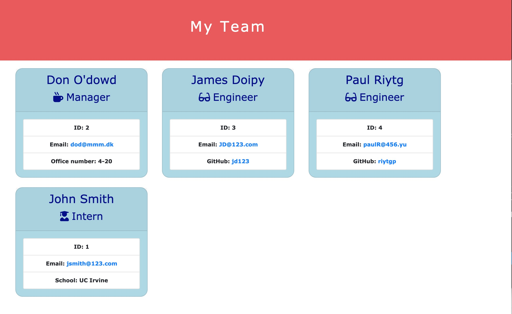

The Employee-Summary application allows a user to create an engineering team comprising of one Manager, as many interns and developers as needed and  Node CLI that takes in information about employees and generates an HTML webpage that displays summaries for each person.

[Empployee-Summary Application Link]((not applicable this is a JS App))

[Empployee-Summary application can be found on repository Employee-Summary](https://github.com/ktywelch/Employee-Summary)

## Table of contents
* [Title](#Title)
* [Installation](#Installation)
* [Usage](#Usage)
* [Technologies](#Technologies)
* [Contributions](#Contributions)
* [Test](#Test)
* [License](#License)
## Installation
The installation pocess is a download of git source, using npm install to install required modules based on the package.json file included in the same directory as the application.

* Download the Application from github (see link above)
* change to the Developer Directory 
* run "npm install" to install the required modules 

## Useage
Users would use this program to input the employee details for Manager, Developers and Interns on a development team. Where there is only one manager but as many developers and interns as neede. The application generates a team.html file that contains the details of the team.

* Change to the Developer directory in the download location "cd Developer"
* Start the program by running "node app.js"
* Answer the questions for each employee and when completed reply n for when asked if there are additional employees

* Once there are no more employees the output is automatically generated and can be found in the relative path ./output/team.html

* There can only be one manager on the team, once a manager role is selected the selection list adjusts to Engineer and Intern Only.
* There following are the criteria:
    * The name so that users have to have a minimum of First and Last Name
    * The email has limited characters an @ sign and 2-3 numbers of letters after the digit
    * The room number is required to have a building numer with a "-" and a room number

## Technologies
The application was created using several opensource technologies used in developing javascript code.

* VSCode
* node.js
* jest (testing solution)
* npm and modules util,inquirer,fs
* bootstrap for styling

## Contributions
Recognizing contributors and sites that helped in development:

* Lauren Hutchinson - Peer Review
* Sam Ayler - Peer Review
* Vincent Gines - Peer Review

## Test
to test the components please run "npm test" from the Developer directory

## License
MIT

Permission is hereby granted, free of charge, to any person obtaining a copy
of this software and associated documentation files (the "Software"), to deal
in the Software without restriction, including without limitation the rights
to use, copy, modify, merge, publish, distribute, sublicense, and/or sell
copies of the Software, and to permit persons to whom the Software is
furnished to do so, subject to the following conditions:

The above copyright notice and this permission notice shall be included in all
copies or substantial portions of the Software.

THE SOFTWARE IS PROVIDED "AS IS", WITHOUT WARRANTY OF ANY KIND, EXPRESS OR
IMPLIED, INCLUDING BUT NOT LIMITED TO THE WARRANTIES OF MERCHANTABILITY,
FITNESS FOR A PARTICULAR PURPOSE AND NONINFRINGEMENT. IN NO EVENT SHALL THE
AUTHORS OR COPYRIGHT HOLDERS BE LIABLE FOR ANY CLAIM, DAMAGES OR OTHER
LIABILITY, WHETHER IN AN ACTION OF CONTRACT, TORT OR OTHERWISE, ARISING FROM,
OUT OF OR IN CONNECTION WITH THE SOFTWARE OR THE USE OR OTHER DEALINGS IN THE
SOFTWARE.